# アーキテクチャ

## 技術スタック

| 項目          | 技術                                   |
|-------------|--------------------------------------|
| Framework   | Spring Boot 3.5.7                    |
| Database    | Spring Data JDBC for ScalarDB 3.14.0 |
| Build Tool  | Gradle 8.2.1                         |
| Java        | OpenJDK 21 (Eclipse Temurin)         |
| Constructor | lombok                               |
| Encrypt     | uuid 7.0.0                           |


## レイヤー構成

```
┌─────────────────────────────────────────────────────────┐
│  Controller層                                            │
│  - HTTPリクエスト受付                                     │
│  - パスパラメータ・リクエストボディのバリデーション          │
│  - レスポンス生成                                         │
└──────────────────────┬──────────────────────────────────┘
                       │
┌──────────────────────▼──────────────────────────────────┐
│  Service層                                               │
│  - ビジネスロジック                                       │
│  - トランザクション管理                                   │
│  - 複数Repositoryの調整                                  │
└──────────────────────┬──────────────────────────────────┘
                       │
┌──────────────────────▼──────────────────────────────────┐
│  Repository層                                            │
│  - ScalarDB Cluster 経由でデータアクセス                  │
└─────────────────────────────────────────────────────────┘
```



```mermaid
---
title: Spring Boot レイヤードアーキテクチャ - データフロー
---

graph TB
    subgraph "【リクエスト（外 → 内）】"
        direction LR
        C1[🌐 Client]
        CT1[📡 Controller]
        S1[⚙️ Service]
        R1[🗄️ Repository]
        DB1[(🛢️ Database)]

        C1 -- "JSON" --> CT1
        CT1 -- "Request DTO\n※Serviceが受け取って\nEntityに変換" --> S1
        S1 -- "Entity" --> R1
        R1 -- "Entity\n（JPA が永続化）" --> DB1
    end

    subgraph "【レスポンス（内 → 外）】"
        direction RL
        DB2[(🛢️ Database)]
        R2[🗄️ Repository]
        S2[⚙️ Service]
        CT2[📡 Controller]
        C2[🌐 Client]

        DB2 -- "Entity\n（JPA が取得）" --> R2
        R2 -- "Entity" --> S2
        S2 -- "Entity\n※DTOに変換しない！" --> CT2
        CT2 -- "JSON\n（Response DTOから\nSpringが自動変換）" --> C2
    end

    subgraph "🚨 変換ルール"
        direction TB
        RULE1["✅ Request DTO → Entity：Service が責任を持つ"]
        RULE2["✅ Entity → Response DTO：Controller が責任を持つ"]
        RULE3["❌ Service が Response DTO を返すのは NG"]
        RULE4["❌ Repository に DTO を渡すのは NG"]
    end

    style C1 fill:#4A90D9,stroke:#2E6BA6,color:#fff
    style CT1 fill:#7BC67E,stroke:#4A9A4D,color:#fff
    style S1 fill:#F5A623,stroke:#D4891A,color:#fff
    style R1 fill:#BD7EC6,stroke:#9A5BA3,color:#fff
    style DB1 fill:#E8E8E8,stroke:#999,color:#333

    style C2 fill:#4A90D9,stroke:#2E6BA6,color:#fff
    style CT2 fill:#7BC67E,stroke:#4A9A4D,color:#fff
    style S2 fill:#F5A623,stroke:#D4891A,color:#fff
    style R2 fill:#BD7EC6,stroke:#9A5BA3,color:#fff
    style DB2 fill:#E8E8E8,stroke:#999,color:#333

    style RULE1 fill:#E8F5E9,stroke:#4CAF50,color:#333
    style RULE2 fill:#E8F5E9,stroke:#4CAF50,color:#333
    style RULE3 fill:#FFEBEE,stroke:#F44336,color:#333
    style RULE4 fill:#FFEBEE,stroke:#F44336,color:#333
```

## パッケージ構造

```
src/main/java/com/review/
├── controller/          # リクエストのハンドリング
├── service/             # ビジネスロジック
├── repository/          # データアクセス層
└── model/
    ├── entity/          # エンティティクラス
    └── dto/
        ├── request/     # リクエストDTO
        └── response/    # レスポンスDTO
```

## 各層の責務

### Controller層

- HTTPリクエストの受信とレスポンスの返却
- 入力値の基本的なバリデーション
- Service層の呼び出し
- HTTPステータスコードの設定
- DTO変換

**やらないこと:** ビジネスロジック、Repository直接呼び出し

### Service層

- ビジネスロジックの実装
- トランザクション境界の管理
- 複数Repositoryを組み合わせた処理
- ドメインルールの適用

**やらないこと:** HTTP関連処理、データアクセス詳細

### Repository層

- データベースへのCRUD操作
- カスタムクエリの定義
- データアクセスロジックのカプセル化

**やらないこと:** ビジネスロジック

### Entity層

- データベーステーブルとのマッピング
- イミュータブルなデータ構造
- `withXxx()` による更新

### DTO層

- レイヤー間のデータ転送
- APIの入出力仕様の定義
- Entityの内部構造の隠蔽

## 主要依存関係

| ライブラリ | バージョン |
|-----------|-----------|
| Java | OpenJDK 21 |
| Gradle | 8.2.1 |
| Spring Boot | 3.5.7 |
| ScalarDB | 3.14.0 |

## タイムスタンプ形式

**必須**: ISO8601（UTC）`yyyy-MM-ddTHH:mm:ssZ`

## DBの型とJava21の型の対応表

| MySQL型 | Java 21型 | 備考 |
|---------|-----------|------|
| `TEXT` | `String` | 可変長文字列 |
| `VARCHAR(n)` | `String` | 固定長文字列 |
| `INT` | `Integer` | NULL許容の場合 |
| `INT NOT NULL` | `int` | NULL不可の場合（プリミティブ） |
| `BIGINT` | `Long` / `long` | 同上 |
| `TIMESTAMP` | `LocalDateTime` | **推奨**（タイムゾーン不要） |
| `DATE` | `LocalDate` | 日付のみ |
| `TIME` | `LocalTime` | 時刻のみ |
| `BOOLEAN` / `TINYINT(1)` | `Boolean` / `boolean` | |
| `DECIMAL(p,s)` | `BigDecimal` | 金額など精度が重要 |
| `DOUBLE` | `Double` / `double` | |